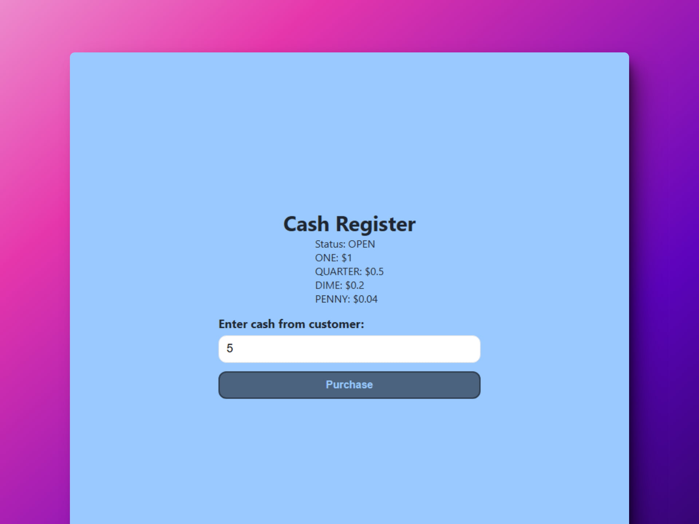

# 🔢 HTML/CSS/JS: Build a Cash Register

### Página de caja registradora

> 🧩 Aquí puedes ver su [**Live Demo.**](https://cash-register-abrahamgalue.netlify.app/)

## 🚀 Descripción

Este proyecto te permite conocer si tienes cambio para una compra en una caja registradora.

## 🧞‍♂️ Especifícaciones:

Your application should show different messages depending on the price of the item, the amount of cash provided by the customer, and the amount of cash in the drawer:

- `"Status: INSUFFICIENT_FUNDS"`: if `cash-in-drawer` is less than the change due, or if you cannot return the exact change.
- `"Status: CLOSED"`: if `cash-in-drawer` is equal to the change due.
- `"Status: OPEN"`: if `cash-in-drawer` is greater than the change due and you can return change, with the change due in coins and bills sorted in highest to lowest order.

| Currency Unit       | Amount             |
| ------------------- | ------------------ |
| Penny               | $0.01 (PENNY)      |
| Nickel              | $0.05 (NICKEL)     |
| Dime                | $0.1 (DIME)        |
| Quarter             | $0.25 (QUARTER)    |
| Dollar              | $1 (ONE)           |
| Five Dollars        | $5 (FIVE)          |
| Ten Dollars         | $10 (TEN)          |
| Twenty Dollars      | $20 (TWENTY)       |
| One-hundred Dollars | $100 (ONE HUNDRED) |

**Objective:** Build an app that is functionally similar to https://cash-register.freecodecamp.rocks
