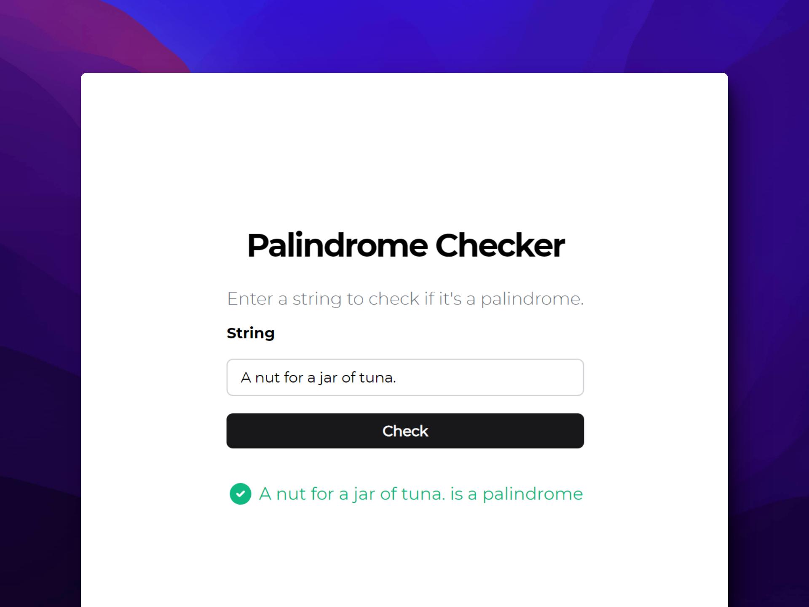

# 📖 HTML/CSS/JS: Build a Palindrome Checker

### Comprobador de Palíndromos

> 🧩 Aquí puedes ver su [**Live Demo.**](https://palindrome-checker-abrahamgalue.netlify.app/)

## 🚀 Descripción

Este proyecto es un verificador de palabras que son **palíndromos**.

## 🧞‍♂️ Especifícaciones:

A palindrome is a word or phrase that can be read the same way forwards and backwards, ignoring punctuation, case, and spacing.

**Note:** You'll need to remove **all non-alphanumeric characters** (punctuation, spaces and symbols) and turn everything into the same case (lower or upper case) in order to check for palindromes.

**Objective:** Build an app that is functionally similar to https://palindrome-checker.freecodecamp.rocks
