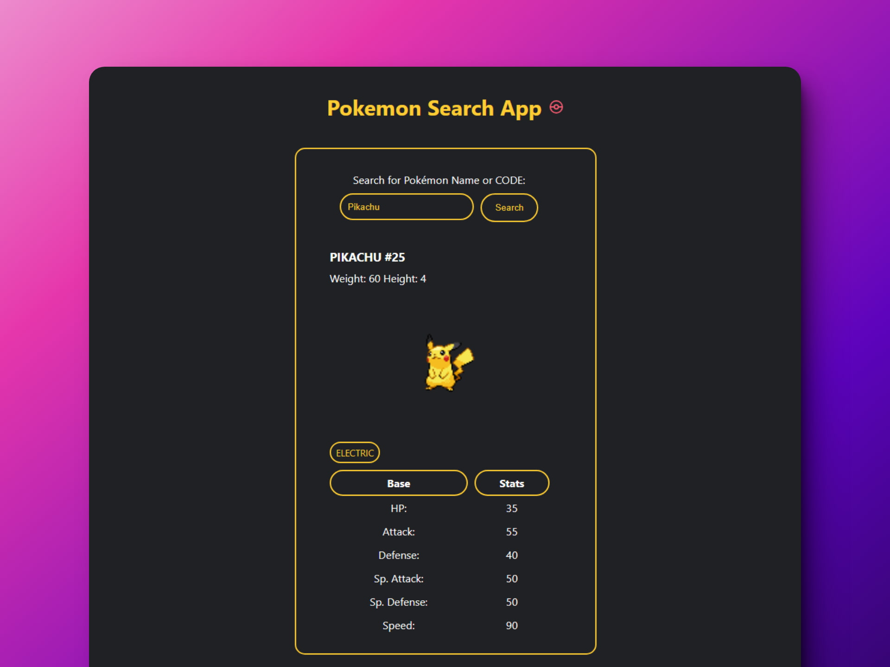
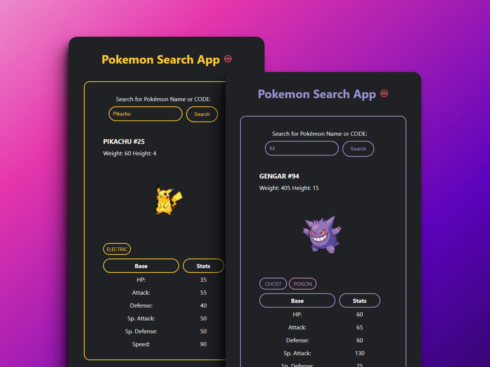

# 🦊 HTML/CSS/JS: Build a Pokémon Search App

### Página para buscar pokemones

> 🧩 Aquí puedes ver su [**Live Demo.**](https://pokemon-search-abrahagalue.netlify.app/)

## 🚀 Descripción

Este proyecto te permite buscar pokemones para conocer sus características y atributos.

## 🧞‍♂️ Especifícaciones:

In this project, you'll build an app that will search for Pokémon by name or ID and display the results to the user. To retrieve the Pokémon data and images, you'll use freeCodeCamp's [PokéAPI Proxy](https://pokeapi-proxy.freecodecamp.rocks/).

**Objective:** Build an app that is functionally similar to https://pokemon-search-app.freecodecamp.rocks
