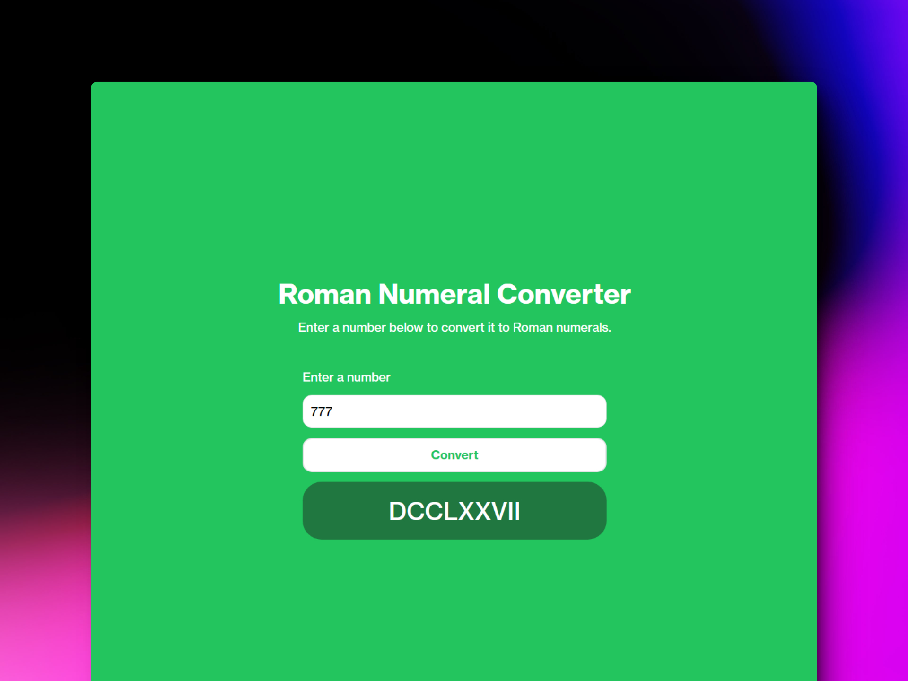

# 🔢 HTML/CSS/JS: Build a Roman Numeral Converter

### Convertidor de números decimales a romanos

> 🧩 Aquí puedes ver su [**Live Demo.**](https://roman-decimal-abrahamgalue.netlify.app/)

## 🚀 Descripción

Este proyecto te permite conocer como se escribe un número decimal en **romano.**

## 🧞‍♂️ Especifícaciones:

Roman numerals are based on seven symbols and can be written using various combinations to represent Arabic numerals. For example:

| Roman numerals | Arabic numerals |
| -------------- | --------------- |
| `M`            | 1000            |
| `CM`           | 900             |
| `D`            | 500             |
| `CD`           | 400             |
| `C`            | 100             |
| `XC`           | 90              |
| `L`            | 50              |
| `XL`           | 40              |
| `X`            | 10              |
| `IX`           | 9               |
| `V`            | 5               |
| `IV`           | 4               |
| `I`            | 1               |

**Objective:** Build an app that is functionally similar to https://roman-numeral-converter.freecodecamp.rocks
