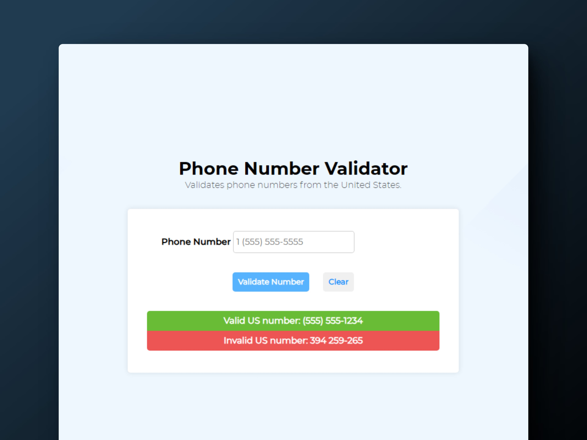

<div align='center'>

# 📱 HTML/CSS/JS: Build a Telephone Number Validator

</div>

### Validador de números de teléfono

> 🧩 Aquí puedes ver su [**Live Demo.**](https://phone-number-validator-abrahamgalue.netlify.app/)



## 🚀 Descripción

Validador de números de teléfonos con formato de USA.

## 🧞‍♂️ Especifícaciones:

In the US, phone numbers can be formatted in many ways. Here are some examples of valid formats for US phone numbers:

```
1 555-555-5555
1 (555) 555-5555
1(555)555-5555
1 555 555 5555
5555555555
555-555-5555
(555)555-5555
```

Note that the area code is required. Also, if the country code is provided, you must confirm that the country code is `1`.

**Objective:** Build an app that is functionally similar to https://telephone-number-validator.freecodecamp.rocks
